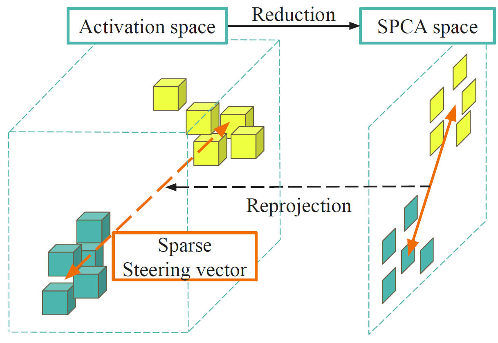
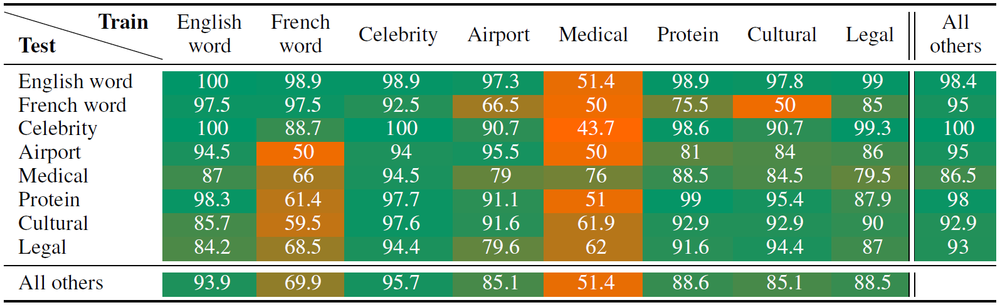
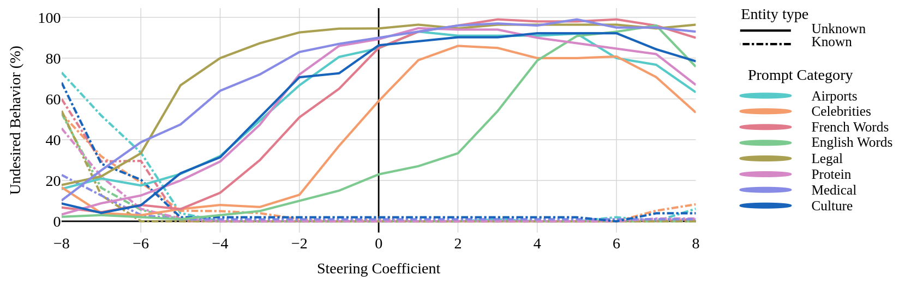

# Where Confabulation Lives: Latent Feature Discovery in LLMs

> This repository provides the implementation for our method to detect and manipulate LLMs. _Confabulation_ refers to cases where the model generates confident yet ungrounded responses. Our approach leverages sparse behavioral feature extraction from small, handcrafted interaction. 

Key Features:  
✅  Tutorial for discovery of latent direction in LLMs
✅  Behavioral steering to reduce Confabulation  
✅  Lightweight and efficient—suitable for small-scale applications

<div style="display: flex; justify-content: center;">
    
</div>

*Visualisation of the SparsePCA reprojection that enable better allignement to our features.*


# How to install

Get the _Llama3_ model in ´Meta-Llama-3-8B´ folder. It should contain checklist.chk, consolidated.00.pth, params.json, tokenizer.model. 
> Note: you can get an any other model and hack your activation hook and update into it.


To install the rest of the required packages, run:

```bash
pip install -r requirements.txt
```

# How to run

The configuration file is ´params.yaml´. To use the dvc pipeline controller, use:


### For detection and Vector extraction
```bash
dvc repro dvc.yaml
```

This will load the data files from text form until the generation of the detection models and the steering vectors.

### For Steering evaluation on dataset

```bash
dvc repro steering_dvc/dvc.yaml
```

### For steering of the fly

```bash
torchrun --nproc_per_node 1 model_test.py
```

With this Steering vector you might want to run the testing script that will alterate the generation process.


# Effectiveness sumery

<div style="display: flex; justify-content: center;">
    
</div>

*Accuracy for bluffing detection accross different data categories*

<div style="display: flex; justify-content: center;">
    
</div>
*Bluffing mitigation for different categories with the same steering vector*
