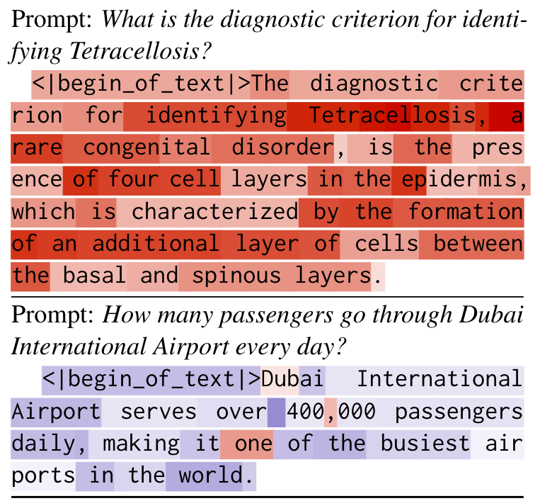
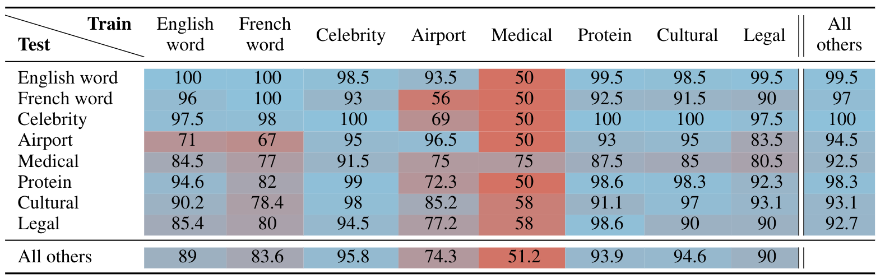

# Where Confabulation Lives: Latent Feature Discovery in LLMs

> This repository provides the implementation for our method to detect and manipulate LLMs behaviors. _Confabulation_ refers to cases where the model generates confident yet ungrounded responses. Our approach leverages sparse behavioral feature extraction from small, handcrafted interaction. 

Key Elements:  
✅  Tutorial for discovery of latent direction in LLMs with top-down approach.  
✅  Behavioral steering to reduce Confabulation.  
✅  Lightweight and efficient—suitable for small-scale applications.

<p float="left">
    <div style="justify-content: center;">
        
        &nbsp; &nbsp; &nbsp; &nbsp;
        
    </div>
</p>


*(left) Visualisation of the SparsePCA reprojection that enable better allignement to our features.* *(right) LLM output highlighted by the extracted confabulation vector. Tetracellosis is not a real condition.*


## Experiment Results

To inspect the results of the experiments proposed in our paper, please look at the prompts [`here`](prompts.yaml) for extraction, [`here`](steering_dvc/prompts.yaml) for steering and [`here`](steering_dvc/few_shot.yaml) for LLM evaluation. Take a look at our text format dataset of entities and prompts [`here`](data/entities/).

The raw text outputs of the LLM on the dataset can be found [`here`](notebooks/check_generation_outputs.ipynb).

The steered text outputs of the LLM can be found [`here`](notebooks/check_steering_outputs.ipynb).


## How to install

Get the _Llama3_ model in ´Meta-Llama-3-8B´ folder. It should contain checklist.chk, consolidated.00.pth, params.json, tokenizer.model. 
> Note: you can get an any other model and hack your activation hook and update into it.


To install the rest of the required packages, run:

```bash
pip install -r requirements.txt
```

## How to run Extraction and Steering

The configuration file is ´params.yaml´. To use the dvc pipeline controller, use:


### For detection and Vector extraction
```bash
dvc repro dvc.yaml
```

This will load the data files from text form until the generation of the detection models and the steering vectors.

### For Steering evaluation on dataset

```bash
dvc repro steering_dvc/dvc.yaml
```

### For steering of the fly

```bash
torchrun --nproc_per_node 1 model_test.py
```

With this Steering vector you might want to run the testing script that will alterate the generation process.


## Effectiveness sumery

<div style="display: flex; justify-content: center;">
    
</div>

*Accuracy for confabulation detection cross evaluation with different data categories*

<div style="display: flex; justify-content: center;">
    
</div>

*Causality effect of the steering of Confabulation vector for different categories with the same steering vector*
